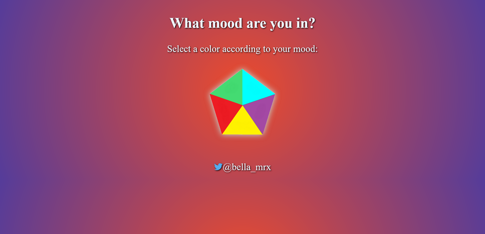
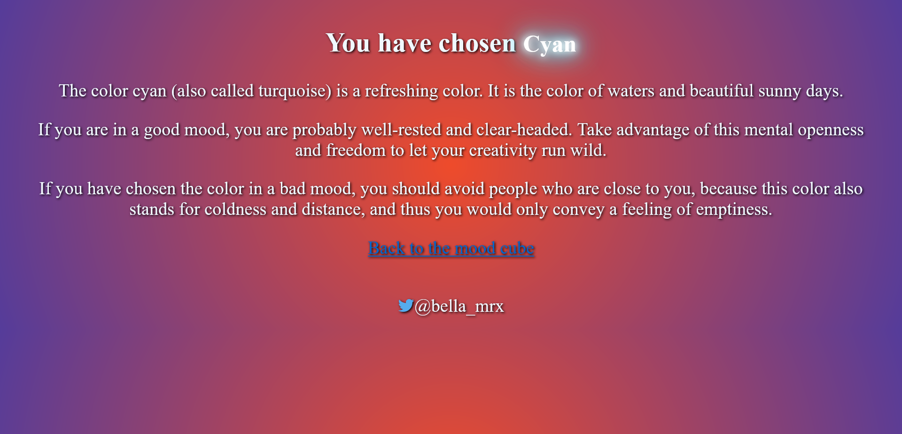
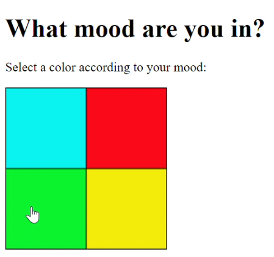
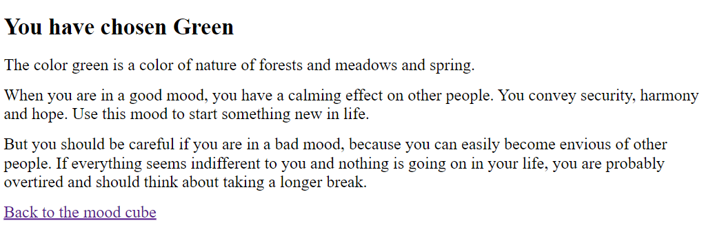
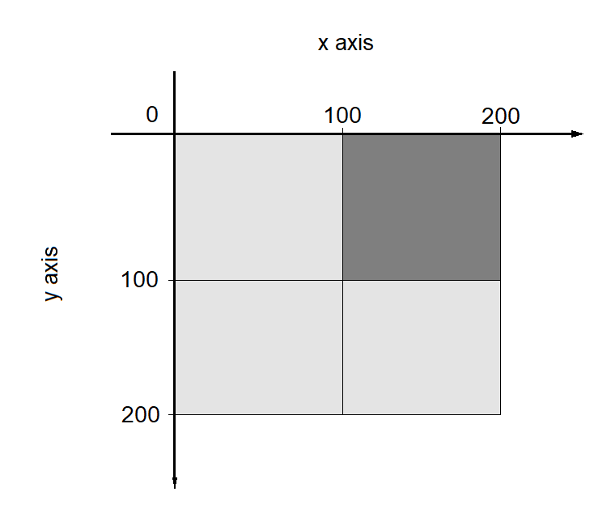

# Mood_Cube

 Mood Cube only in HTML and CSS with HTML Image map

 Save the files in a folder and open the file "index.html" in your browser.

 Video on [YouTube](https://youtu.be/KQFPVJfjeZM)

 

 


-----------------------------------------------------------------------------------------------
# HTML Image Map Tutorial 

* Reference-sensitive graphics (image maps) are links that are embedded within a graphic. An image map defined in HTML consists of three parts:
  - the actual image added to the HTML document with the img element, additionally within the `` -tag the attribute `usemap` must be specified with an anchor to a `map` element
     ```
        
     ``` 
  - the `map` element with the anchor name previously specified in the img element with the usemap attribute, it is recommended to place the `map` element at the beginning or at the end of the document
  - between `<map>` and `</map>` an area element is used for each area, there the coordinates with the actual reference sensitive area for the graphic are needed. Within the `<area>` tag, you can define a square area, a circular area, or a polygon. Each area element defines a clickable area in the image.

| HTML elements | Explanation          								  |
| ------------- | --------------------------------------------------- |
| ``       | Inserting a graphic with an anchor on a map element |
| `<map>`    	| Area for the reference sensitive graphic            |
| `<area>`    	| This defines a clickable area in the image          |

  - example --> *example/index.html*
  - in this example, in a rectangular graphic with 200 x 200 pixels, four rectangular reference-sensitive areas with 100 x 100 pixels have been defined. First the graphic popart.jpg is inserted into the HTML document. The value `#mood` is used as the anchor name in the `usemap` attribute. The reference sensitive area is introduced with the `map` element and the name of the image map (name="mood"). Between `<map>` and `</map>` the coordinates for the references are specified with the `area` element.

    ```
      <h1>What mood are you in?</h1>
      <p>Select a color according to your mood:</p>
      <p>
          
      </p>
      <map name="mood">
        <area shape="rect" coords="0,0,100,100" href="Colors/cyan.html" alt="Cyan" title="Cyan">
        <area shape="rect" coords="0,100,100,200" href="Colors/green.html" alt="Green" title="Green">
        <area shape="rect" coords="100,100,200,200" href="Colors/yellow.html" alt="Yello" title="Yellow">
        <area shape="rect" coords="100,0,200,100" href="Colors/red.html" alt="Red" title="Red">
      </map>
    ``` 





* HTML attributes for the HTML element \<area>
  - The shape attribute specifies the `shape` of an area. The `shape` attribute is used together with the `coords` attribute to specify the size, shape, and placement of an area.
  - Three forms are available for this:
    - `rect` (= rectangle)
    - `circle`
    - `poly` (= polygon)
  - The `coords` attribute specifies the coordinates of an area in an image map. The `coords` attribute is used together with the shape attribute to specify the size, shape, and placement of an area.
  - The coordinates of the top-left corner of an area are `0,0`.
     ```
      <area shape="rect" coords="0,0,100,100" ...>
     ```
  - If circle is used with shape, the coordinates are x,y,r (`chords="x,y,r"`). 
     ```
      <area shape="circle" coords="100,100,50" ...>
     ```
  - If poly is used with shape, any number of coordinates with **x1,y1,x2,y2...xn,yn** can be used in coords. 
     ```
      <area shape="poly" coords="129,0,260,95,129,138">
     ```
Pixel coordinates with a graphics program [Online Image Map Editor](http://maschek.hu/imagemap/imgmap/)




| attribute     | Explanation         								|
| ------------- | ------------------------------------------------- |
| `alt`         | Allows you to specify an alternative text that will be displayed when the if the link-sensitive graphic is not displayed. For valid valid HTML, this attribute must also be used with any area element when the href attribute is used |
| `coords`   	  | Here you specify the coordinates for the reference sensitive area. These are absolute values that you must separate with commas. |
| `download`    | You use this to specify a URL or pathname to a file that can be can be downloaded when the user clicks the link. |
| `href`    	  | Here you specify the link for the reference target of the link-sensitive area that will be called when the user clicks on it. If attribute is not used, this area element is not a hyperlink. hyperlink. |
| `hreflang`    | This specifies the language of the reference target of the reference-sensitive area. |
| `media`    	  | This allows you to specify the media type of the link or a resource specify |
| `type`   	    | Sets the MIME type of the destination address. |

| `rel`    	    | This specifies the type of relationship between the current document and the link. Possible values are: |
| ----------------- | ----------------------------------------------------- |
| `rel="alternate"` | Link to an alternative version of the document        |
| `rel="author"`    | Link to the author of the document                    |
| `rel="bookmark"`  | permanent URL to create a bookmark                    |
| `rel="help"`      | Links to a help document                              |
| `rel="license"`   | Links to copyright information for the document       |
| `rel="next"`      | the next document in a selection of documents         |
| `rel="nofollow":` | Links that search engines should not follow (e.g. commercial advertising page) |
| `rel="noreferrer"`| The web browser should not send an HTTP ReferrerHeader when the user follows the link.                                                                       |
| `rel="prefetch"`  | Specifies that the target resource should be cached.  |
| `rel="prev"`      | The previous document in a selection of documents     |
| `rel="search"`    | The target document should be preloaded in the cache of the cache. |
| `rel="tag"`       | a keyword for the current document                    |

| `shape`    	      | This determines the type of area for the reference-sensitive area of a reference-sensitive graphic. The possible values for this are:                               |
| ----------------- | ---------------------------------------------------------------------- |
| `shape="circle"`  | a circle with the coordinates x (center from left), y (center from top) and r (radius) for the coord attribute                            |
| `shape="rect"`    | a rectangle with the coordinates x1, y1 (upper left corner) and x2, y2 corner) and x2, y2 (lower right corner) for the coord attribute                              |
| `shape="poly"`    | a polygon with the coordinates x1, y1, x2, y2, ..., xn, yn(from the upper left corner) for the coord attribute                                         |

| `target`  | This sets the target window for the content to be called. Possible values for this are: |
| --------- | ---------------------------------------------------------------------- |
| `_self`   | (default value) output in the same window                              |
| `_blank`  | output in a new window or tab                                          |
| `_top`    | Output in the body of the window                                       |
| `_parent` | output in the calling window                                           |


### On my Twitter account [@bella_mrx](https://twitter.com/bella_mrx) you can find more useful stuff about web development.